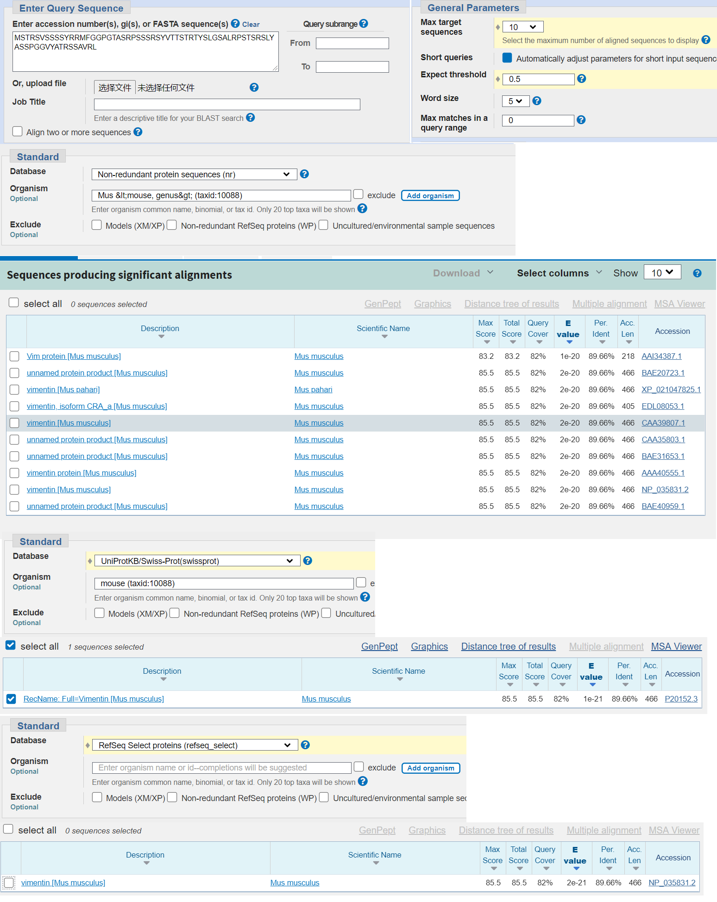

## Homework 4    

对于序列`MSTRSVSSSSYRRMFGGPGTASRPSSSRSYVTTSTRTYSLGSALRPSTSRSLYASSPGGVYATRSSAVRL`:      

### 1. 请使用网页版的 blastp, 将上面的蛋白序列只与 mouse protein database 进行比对， 设置输出结果最多保留10个， E 值最大为 0.5。将操作过程和结果截图，并解释一下 E value和 P value 的实际意义。
     
P值的意义是，用完全随机的序列比对得到的S值大于等于本序列的S值的概率。是衡量score值的另一种方式。    
E值指满足上述条件的序列的条数的期望数量。     

### 2. 请使用 Bash 脚本编程：将上面的蛋白序列随机打乱生成10个， 然后对这10个序列两两之间进行 blast 比对，输出并解释结果。（请上传bash脚本，注意做好重要code的注释；同时上传一个结果文件用来示例程序输出的结果以及你对这些结果的解释。）
脚本文件hw4.sh    
```
#!/bin/bash
# input
file=hw4_2_seq.fa
touch ${file}
s="MSTRSVSSSSYRRMFGGPGTASRPSSSRSYVTTSTRTYSLGSALRPSTSRSLYASSPGGVYATRSSAVRL"

init=0
len=${#s}
ter=${len-1}

# Shuffle
for i in {1..10}
do
	shuffled=""
	# Generate random seq of num
	for j in `seq $init $ter | shuf`;
	do
		shuffled=$shuffled${s:$j:1}
	done
	echo '>shuffled'$i >> ${file}
	echo $shuffled >> ${file}
done
blastp -query ${file} -subject ${file} -out hw4_result
```
结果选段(结果文件见hw4_result)：     
```
Query= shuffled5

Length=70
                                                                      Score     E
Sequences producing significant alignments:                          (Bits)  Value

  shuffled5                                                           123     2e-43
  shuffled7                                                           13.5    3.2  
  shuffled8                                                           12.7    6.3  
```
序列5与自身比对，S值最高、E值最低。     
而该序列与其它重排序列比对，由于是随机打乱的，故S值近似且都很低，E值较大。   
```
> shuffled7
Length=70

 Score = 13.5 bits (23),  Expect = 3.2, Method: Compositional matrix adjust.
 Identities = 5/16 (31%), Positives = 13/16 (81%), Gaps = 0/16 (0%)

Query  55  SPGYSSYSSSAGSVYS  70
           +P  S++SS++ ++Y+
Sbjct  38  TPRVSTFSSASSTMYT  53
```
序列5和序列7的比对，可见序列5的55-70位与序列7的38-53位的匹配情况最好。   

### 3. 解释blast 中除了动态规划（dynamic programming）还利用了什么方法来提高速度，为什么可以提高速度。   
除了动态规划还用了一种启发式算法，即先将query序列打断成很多子片段，称为seed words。然后把这些seed和预先索引好的序列进行比对，选择seed更连续、打分更高的位置，再用动态规划算法进行延伸，延伸过程中当分数低于某一阈值这个片段就会被抛弃，最后得到一系列的高得分序列，并用E值等评估显著性，得到最终结果。  
这样做的好处在于计算并存储了短片段的hash值，这样比较短片段是否相同的过程就被简化为了比较哈希值的过程，减少了很多计算量。   

### 4. 我们常见的PAM250有如下图所示的两种（一种对称、一种不对称），请阅读一下 "Symmetry of the PAM matrices"，再利用Google/wikipedia等工具查阅更多资料，然后总结和解释一下这两种（对称和不对称）PAM250不一样的原因及其在应用上的不同。    
不对称的矩阵是mutation probability matrix M，

对称的PAM矩阵


参考：   
[blast算法初探](https://www.jianshu.com/p/c2dec8829265)   

