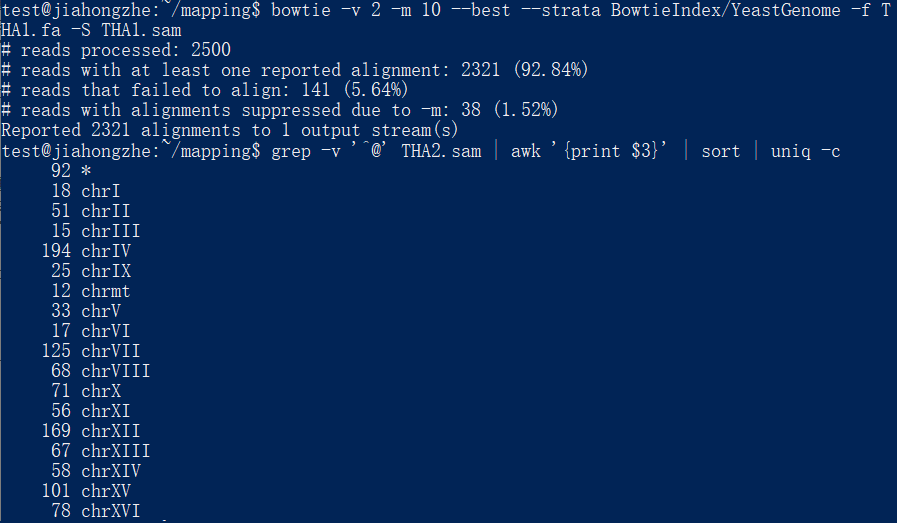
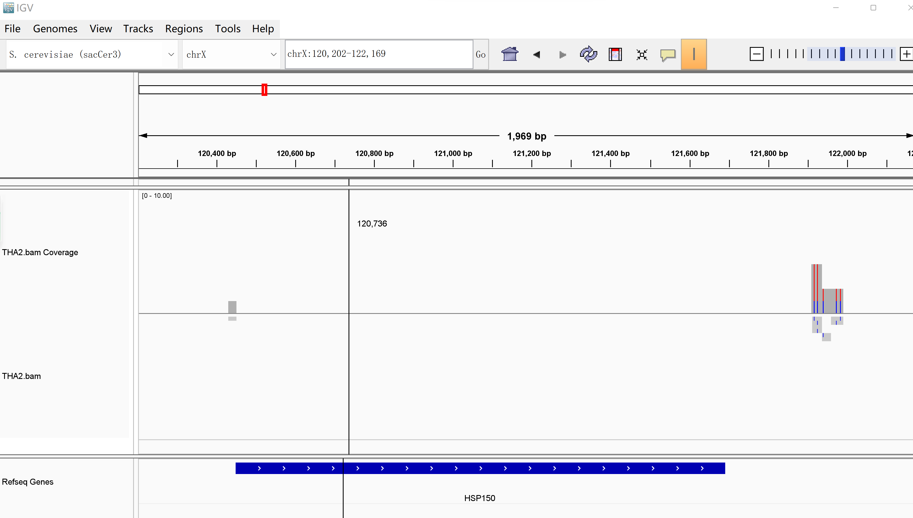

## Homework 5    
    
### 1. 请阐述bowtie中利用了 BWT 的什么性质提高了运算速度？并通过哪些策略优化了对内存的需求？  
利用BWT变换后的保序性，在查找到匹配片段后可以快速找到前文，从而快速找到片段在整个参考序列中的位置，提高了查找时的速度。      
通过间隔记录而非记录全部索引的方式，减小了存储索引占用的空间，优化了内存需求。    
    
### 2. 用bowtie将 THA2.fa mapping 到 BowtieIndex/YeastGenome 上，得到 THA2.sam，统计mapping到不同染色体上的reads数量(即统计每条染色体都map上了多少条reads)。
```  
# 将THA1.fa的reads mapping到酵母基因组上  
bowtie -v 2 -m 10 --best --strata BowtieIndex/YeastGenome -f THA1.fa -S THA1.sam
# 输出统计过的reads数量
grep -v '^@' THA2.sam | awk '{print $3}' | sort | uniq -c
```  
输出：     
 
    
### 3. 查阅资料，回答以下问题:     
（3.1）什么是sam/bam文件中的"CIGAR string"? 它包含了什么信息?    
CIGAR string 的作用是记录该序列和参考序列相比对时，匹配、插入、删除的数量及位置等情况。    
（3.2）"soft clip"的含义是什么，在CIGAR string中如何表示？   
"soft clip"的含义是在序列两侧比对不上参考序列，但是仍然保存在SAM文件的reads中的片段；在CIGAR string中用S加数字表示。     
（3.3）什么是reads的mapping quality? 它反映了什么样的信息?   
mapping quality等于-10 * log10{mapping位置出错的概率}，它反映了mapping到该位置的可信度。       
（3.4）仅根据sam/bam文件的信息，能否推断出read mapping到的区域对应的参考基因组序列? (提示:参考https://samtools.github.io/hts-specs/SAMtags.pdf中对于MD tag的介绍)       
可以推断出来。根据MD tag 记录的插入、删除等信息和CIGAR的信息可以在query序列的基础上重建出参考序列。      

### 4. 软件安装和资源文件的下载也是生物信息学实践中的重要步骤。请自行安装教程中未涉及的bwa软件，从UCSC Genome Browser下载Yeast (S. cerevisiae, sacCer3)基因组序列。使用bwa对Yeast基因组sacCer3.fa建立索引，并利用bwa将THA2.fa，mapping到Yeast参考基因组上，并进一步转化输出得到THA2-bwa.sam文件。   

```
# 下载bwa
wget https://sourceforge.net/projects/bio-bwa/files/bwa-0.7.17.tar.bz2
tar jxf bwa-0.7.17.tar.bz2
cd bwa-0.7.17
# 安装
make
echo 'PATH=$PATH:/home/test/mapping/bwa--*' >> ~/.bashrc
source ~/.bashrc
./bwa
# 下载序列sacCer3.fa.gz（从https://hgdownload.soe.ucsc.edu/goldenPath/sacCer3/bigZips/）
# 解压序列文件
gunzip sacCer3.fa.gz
# 进入目录
cd /home/test/mapping/bwa-0.7.17
# 创建索引
./bwa index /home/test/mapping/sacCer3.fa
# 生成sam文件
./bwa aln /home/test/mapping/sacCer3.fa /home/test/mapping/THA2.fa > /home/test/mapping/THA2_bwa_aln.sai
./bwa samse /home/test/mapping/sacCer3.fa /home/test/mapping/THA2_bwa_aln.sai /home/test/mapping/THA2.fa > /home/test/mapping/THA2_bwa.sam
# 输出比对结果
grep -v '^@' /home/test/mapping/THA2_bwa.sam | awk '{print $3}' | sort | uniq -c
cp /home/test/mapping/THA2_bwa.sam /home/test/share/

# 用samtools将sam转换为bam文件供后续操作
samtools index -@ 8 /home/test/mapping/THA2_bwa.bam
samtools view -bS /home/test/mapping/THA2_bwa.sam > /home/test/mapping/THA2_bwa.bam 
cp /home/test/mapping/THA2_bwa.bam /home/test/share/
```
比对结果：    
```
     24 *
     17 chrI
     54 chrII
     17 chrIII
    202 chrIV
     26 chrIX
     18 chrM
     38 chrV
     18 chrVI
    129 chrVII
     70 chrVIII
     77 chrX
     60 chrXI
    178 chrXII
     72 chrXIII
     59 chrXIV
    108 chrXV
     83 chrXVI
```

### 5. 利用Genome Browser浏览 1.Mapping的 Homework 得到的sam/bam文件，并仿照上文中的 examples截图展示一个 gene的区域。   
将bam文件导入IGV，图中显示其中一个区域。     
 


参考：   
1. [孟浩巍 - 知乎](https://www.zhihu.com/people/meng_howard)

