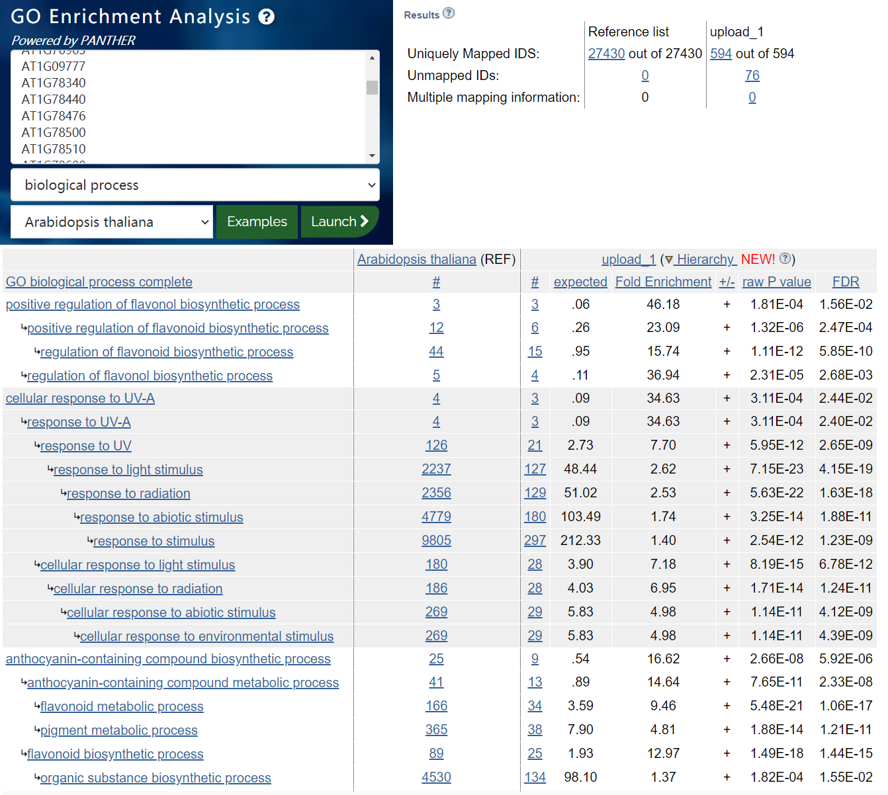
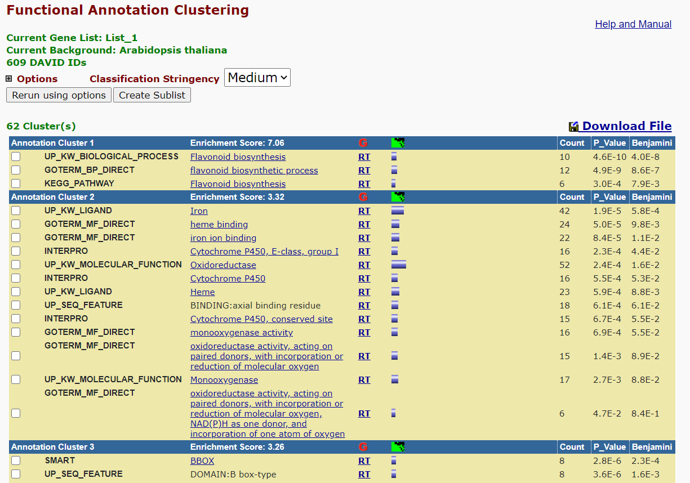

## Homework 9     
### III.2.3.Differential Expression with DEseq2 and edgeR         
1. 什么是Multiple test correction? 并解释 q value(很多时候也叫FDR) 和 p value 的差别。     
       
对单参数进行假设检验时使用p值来判断应接受还是拒绝原假设。而使用同一组数据同时进行多个假设检验时，应对p值进行校正(更宽松)，以降低犯拒真错误的概率。         
q value(FDR)即false discovery rate，其意义为在假设检验中假阳性占比的期望，并不局限于单次假设检验；而p value则是控制单次检验中假阳性率的指标。     
       
2. 请结合上课时所讲的知识阐述DESeq2和edgeR中如何对数据进行 normalization，列出并解释具体的公式 。     
     
DESeq2使用RLE进行归一化：    
原始的表达量矩阵每一行代表一个基因，每一列代表一个样本，首先取raw counts的对数值，再计算每个基因的此对数值在所有样本中的均值；将每个基因的表达量减去对应的均值，然后取中位数，该中位数即为size factor。每个样本的raw counts除以该样本的sizefactor，就得到了归一化之后的表达量。      
$log(size\quad factor)=median(\frac{log(raw \quad counts_i)}{\frac{1}{n}\sum_i log(raw \quad counts_i)})$      
$normalized \quad expression_i=\frac{raw \quad counts_i}{size \quad factor}$
        
而edgeR使用TMM counts       
首先对每个样本计算CPM并排序后，计算75%分位数的平均值，选择其75%分位数最接近平均值的样本作参考样本。          
然后计算每个基因在样本和参考样本中的log fold change，并去掉log fold change前30\%和后30\%的基因          
$log \quad fold \quad change=log_2 \frac{CPM \quad in \quad ref}{CPM \quad in \quad sample}$           
将每个基因在样本和参考中的表达量取对数后求平均后，去掉平均值前5\%和后5\%的基因                 
$average \quad level= \frac{log_2 (CPM \quad in \quad ref)+log_2 (CPM \quad in \quad sample)}{2}$       
将剩下的基因的log fold change按raw counts数加权求平均，再减去自身的均值，即得到每个样本的标准化因子          
$weighted \quad average= \frac{ \sum read \quad counts \cdot log \quad fold \quad change}{total \quad reads}$        
$log_2 scaling \quad factor=weighted \quad average- \frac{ \sum weighted \quad average}{n}$     
      
最后，将每个raw counts除以该标准化因子即可归一化         
$normalized \quad expression_i=\frac{raw \quad counts_i}{log_2 scaling \quad factor}$     
    
3. 利用我们以上介绍的方法和数据，分别使用DESeq2和edgeR找出uvr8突变型（uvr8）在光照前后的差异基因，保存为文本文件       
     
文本文件见本md所在目录。          
[uvr8.light.vs.dark.txt](uvr8.light.vs.dark.txt)     
[edger.uvr8.light.vs.dark.txt](edger.uvr8.light.vs.dark.txt)      
脚本代码如下：     
```
raw.counts <- read.table("count_exon.txt", sep='\t', header = T,row.names = 1)     #只使用野生型数据
uvr8.raw.counts <- raw.counts[,c("UD1_1", "UD1_2", "UD1_3", "UD0_1", "UD0_2", "UD0_3")]
uvr8.filtered.counts <- uvr8.raw.counts[rowMeans(uvr8.raw.counts) > 5, ]          #过滤掉表达量过低的基因

conditions <- factor(c(rep("Control", 3), rep("Treatment", 3)),levels = c("Control","Treatment"))
colData <- data.frame(row.names = colnames(uvr8.filtered.counts),conditions=conditions)

#DESeq2
library(DESeq2)
suppressPackageStartupMessages(library(DESeq2))

dds <- DESeqDataSetFromMatrix(uvr8.filtered.counts, colData, design = ~conditions)#进行差异分析
dds <- DESeq(dds)
res <- results(dds)#获取结果

diff.table <- subset(res, padj < 0.05 & abs(log2FoldChange) > 1)
write.table(diff.table,"uvr8.light.vs.dark.txt", sep='\t', row.names = T, quote = F)


# edgeR
conditions <- factor(c(rep("Control", 3), rep("Treatment", 3)),levels = c("Control","Treatment"))
design <- model.matrix(~conditions)#获取design矩阵
library(edgeR) 
y <- DGEList(counts = uvr8.filtered.counts) # 定义edgeR用于存储基因表达信息的DGEList对象
y <- calcNormFactors(y, method="TMM")# TMM标准化

# 估计dispersion
y <- estimateDisp(y,design = design)
# 拟合广义线性模型
fit <- glmFit(y, design = design)
# 似然比检验
# coef = 2指的是对design矩阵的第二列（即是否照光）对应的系数进行检验
lrt <- glmLRT(fit,coef=2) 

diff.table <- topTags(lrt, n = nrow(y))$table
diff.table.filtered <- diff.table[abs(diff.table$logFC) > 1 & diff.table$FDR < 0.05,]
write.table(diff.table.filtered, file = 'edger.uvr8.light.vs.dark.txt', sep = "\t", quote = F, row.names = T, col.names = T)
```
      
4. 对于uvr8突变型的差异基因，定义|log2FC|>1，FDR<0.05的基因为差异表达基因。比较两个软件得到的差异基因有多少是重合的，有多少是不同的，用venn图的形式展示     
结果：      

      
代码：     
```
d.table=read.table("uvr8.light.vs.dark.txt",sep='\t')
e.table=read.table("edger.uvr8.light.vs.dark.txt",sep='\t')
d.table=rownames(d.table)
e.table=rownames(e.table)
library(VennDiagram)
venn.plot <- venn.diagram(
  x = list(
    "DESeq2" = d.table,
    "edgeR" = e.table
  ),
  filename = "Venn_week9.jpeg",
)
```
       
5. 对于edgeR找出的FDR<0.05的基因，选出log2FoldChange最大的10个基因和最小的10个基因，计算表达量log10CPM的Z-score并作热图（heatmap）    
         
代码：    
```
# 计算z score
e.table$z.scores=(e.table$logCPM - mean(e.table$logCPM)/sd(e.table$logCPM))
e.table=e.table[order(e.table$logFC),]
top=e.table[c(1:10,49:58),]
z.score=top[c('z.scores')]

library(pheatmap)
pheatmap(z.score,
         color = colorRampPalette(c("red", "white", "yellow"))(50),
         cutree_col = 2,
         cluster_cols=F,
         annotation_colors = list(TumorType = c(COAD = "red", ESCA = "yellow", READ = "blue"))
         )
```
热图：       

             
      
### II.3.1 GO       
1. 从wt.light.vs.dark.all.txt(这是我们在差异表达一节获得的野生型的结果)中选取显著上调的(FDR<0.05, logFC>1)的基因进行GO分析。       
      
GO分析结果见如下文本文档和图片：       
[analysis_GO_week9.txt](analysis_GO_week9.txt)      
     
        
3. 请问上面的例子中， Fold Enrichment和P value是如何计算的? 请写出公式，并解释原理。此外，在定义显著富集的 GO terms 时为什么一般不是参考P value的大小，而是要计算一个 FDR来做为参考？               
       
Fold Enrichment即计算某GO term在样本中的占比为整个数据库中的多少倍：     
$Fold \quad Enrichment = \frac{counts \quad in \quad sample}{sample \quad size} \cdot \frac{database \quad size}{counts \quad in \quad database} $
      
而p-value的意义即为随机抽取样本时得到当前结果的概率。       
设数据库中基因总数为N，该GO term下的基因数目为K，样本包含n个基因，其中k个属于该GO term。若完全随机地从数据库中抽取n个基因，其中属于该GO term的基因数X应服从超几何分布H(N,n,K)，即  $P(X=k)= \frac{C_K^k C_{N-K}{n-k}}{C_N^n} $ ，这一概率即为raw p-value。         
         
计算FDR是因为在GO analysis中，每一个样本涉及到的GO term都要经过假设检验，判断是否显著，所以需要计算FDR，作多重检验校正，以防止假阳性率过高。
       
       
### II.3.2 KEGG     
1. 请用 KEGG enrichment 分析上一章(GO enrichment analysis)中的基因集，比较两章的结果，总结两种方法得到的生物学意义有哪些异同。        
      
KEGG分析结果见如下文本文档和图片：       
[analysis_KEGG.txt](analysis_KEGG.txt)      
     
       
 GO分析中得到的结果与黄酮醇生物合成调控、对UV-A的响应、花色素苷合成、蓝光响应、质体定位、叶绿体定位、远红光响应等等有关。       
        
 而KEGG分析的结果聚为几类，分别与类黄酮合成调控、氧化还原酶活性、糖苷转移酶、锌指结构域、双氧化酶活性调控、Myb结构域、谷胱甘肽代谢等等过程有关。           
         
 由此我们可以看出GO分析的结果通常更关注较为宏观的生物学过程和现象，而KEGG更关心的是代谢通路、分子结构等更为微观的过程。      
 
 
 
 


