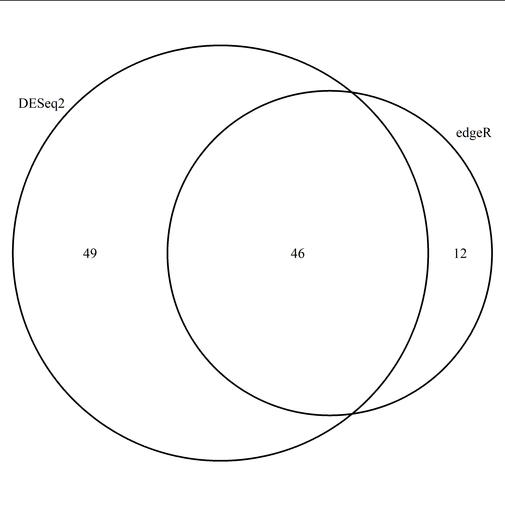
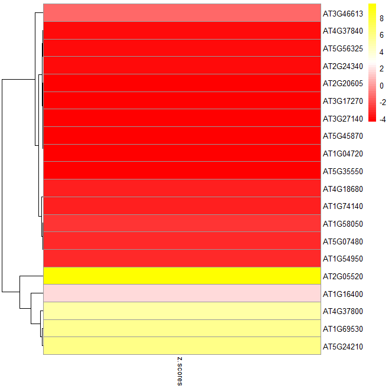

## Homework 9     
### III.2.3.Differential Expression with DEseq2 and edgeR         
1. 什么是Multiple test correction? 并解释 q value(很多时候也叫FDR) 和 p value 的差别。     
       
对单参数进行假设检验时使用p值来判断应接受还是拒绝原假设。而使用同一组数据同时进行多个假设检验时，应对p值进行校正(更宽松)，以降低犯拒真错误的概率。         
q value(FDR)即false discovery rate，其意义为在假设检验中假阳性占比的期望，并不局限于单次假设检验；而p value则是控制单次检验中假阳性率的指标。     
       
2. 请结合上课时所讲的知识阐述DESeq2和edgeR中如何对数据进行 normalization，列出并解释具体的公式 。     
     
DESeq2使用RLE 
而edgeR使用TMM counts 
    
3. 利用我们以上介绍的方法和数据，分别使用DESeq2和edgeR找出uvr8突变型（uvr8）在光照前后的差异基因，保存为文本文件       
     
文本文件见：     

脚本代码如下：     
```
raw.counts <- read.table("count_exon.txt", sep='\t', header = T,row.names = 1)     #只使用野生型数据
uvr8.raw.counts <- raw.counts[,c("UD1_1", "UD1_2", "UD1_3", "UD0_1", "UD0_2", "UD0_3")]
uvr8.filtered.counts <- uvr8.raw.counts[rowMeans(uvr8.raw.counts) > 5, ]          #过滤掉表达量过低的基因

conditions <- factor(c(rep("Control", 3), rep("Treatment", 3)),levels = c("Control","Treatment"))
colData <- data.frame(row.names = colnames(uvr8.filtered.counts),conditions=conditions)

#DESeq2
library(DESeq2)
suppressPackageStartupMessages(library(DESeq2))

dds <- DESeqDataSetFromMatrix(uvr8.filtered.counts, colData, design = ~conditions)#进行差异分析
dds <- DESeq(dds)
res <- results(dds)#获取结果

diff.table <- subset(res, padj < 0.05 & abs(log2FoldChange) > 1)
write.table(diff.table,"uvr8.light.vs.dark.txt", sep='\t', row.names = T, quote = F)


# edgeR
conditions <- factor(c(rep("Control", 3), rep("Treatment", 3)),levels = c("Control","Treatment"))
design <- model.matrix(~conditions)#获取design矩阵
library(edgeR) 
y <- DGEList(counts = uvr8.filtered.counts) # 定义edgeR用于存储基因表达信息的DGEList对象
y <- calcNormFactors(y, method="TMM")# TMM标准化

# 估计dispersion
y <- estimateDisp(y,design = design)
# 拟合广义线性模型
fit <- glmFit(y, design = design)
# 似然比检验
# coef = 2指的是对design矩阵的第二列（即是否照光）对应的系数进行检验
lrt <- glmLRT(fit,coef=2) 

diff.table <- topTags(lrt, n = nrow(y))$table
diff.table.filtered <- diff.table[abs(diff.table$logFC) > 1 & diff.table$FDR < 0.05,]
write.table(diff.table.filtered, file = 'edger.uvr8.light.vs.dark.txt', sep = "\t", quote = F, row.names = T, col.names = T)
```
      
4. 对于uvr8突变型的差异基因，定义|log2FC|>1，FDR<0.05的基因为差异表达基因。比较两个软件得到的差异基因有多少是重合的，有多少是不同的，用venn图的形式展示     
结果：      

      
代码：     
```
d.table=read.table("uvr8.light.vs.dark.txt",sep='\t')
e.table=read.table("edger.uvr8.light.vs.dark.txt",sep='\t')
d.table=rownames(d.table)
e.table=rownames(e.table)
library(VennDiagram)
venn.plot <- venn.diagram(
  x = list(
    "DESeq2" = d.table,
    "edgeR" = e.table
  ),
  filename = "Venn_week9.jpeg",
)
```
       
5. 对于edgeR找出的FDR<0.05的基因，选出log2FoldChange最大的10个基因和最小的10个基因，计算表达量log10CPM的Z-score并作热图（heatmap）    
         
代码：    
```
# 计算z score
e.table$z.scores=(e.table$logCPM - mean(e.table$logCPM)/sd(e.table$logCPM))
e.table=e.table[order(e.table$logFC),]
top=e.table[c(1:10,49:58),]
z.score=top[c('z.scores')]

library(pheatmap)
pheatmap(z.score,
         color = colorRampPalette(c("red", "white", "yellow"))(50),
         cutree_col = 2,
         cluster_cols=F,
         annotation_colors = list(TumorType = c(COAD = "red", ESCA = "yellow", READ = "blue"))
         )
```
热图：       

             
      
### II.3.1 GO       
1. 从wt.light.vs.dark.all.txt(这是我们在差异表达一节获得的野生型的结果)中选取显著上调的(FDR<0.05, logFC>1)的基因进行GO分析。     

3. 请问上面的例子中， Fold Enrichment和P value是如何计算的? 请写出公式，并解释原理。此外，在定义显著富集的 GO terms 时为什么一般不是参考P value的大小，而是要计算一个 FDR来做为参考？       


### II.3.2 KEGG     
1. 请用 KEGG enrichment 分析上一章(GO enrichment analysis)中的基因集，比较两章的结果，总结两种方法得到的生物学意义有哪些异同。     


